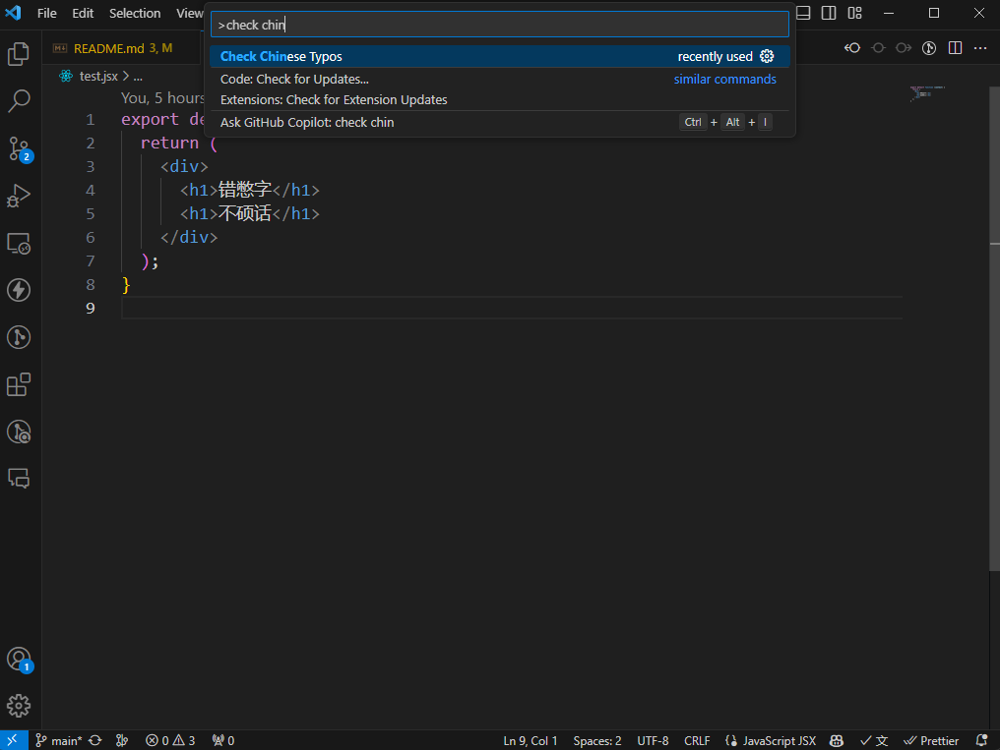
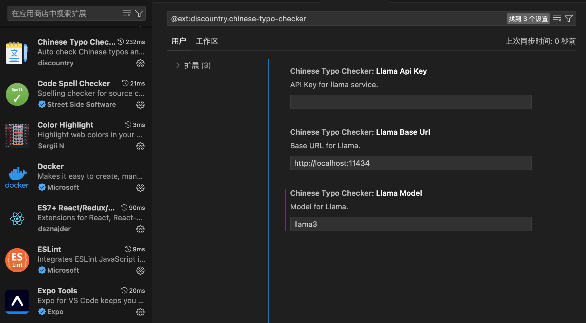

# 中文错别字检查器

[](https://marketplace.visualstudio.com/items?itemName=discountry.chinese-typo-checker)
[](https://marketplace.visualstudio.com/items?itemName=discountry.chinese-typo-checker)
[](https://marketplace.visualstudio.com/items?itemName=discountry.chinese-typo-checker)

[English Readme](./README_en.md)

在 VS Code 中自动检查中文拼写错误并提供快速修复。

## 安装

[Youtube 视频简介](https://www.youtube.com/watch?v=HVVXktaCCPk)

从 [VS Code Marketplace](https://marketplace.visualstudio.com/items?itemName=discountry.chinese-typo-checker) 下载并安装

### 使用 ollama

ollama 是在本地运行开源语言模型的平台，下载安装 [ollama](https://ollama.com/)

安装完成后加载模型：

```bash
ollama run llama3
```

在 VS Code 中使用：

```
ctrl + shift + p
```

输入并选择 `检查中文错别字`。



观看魔法。

## 设置



## 预览


