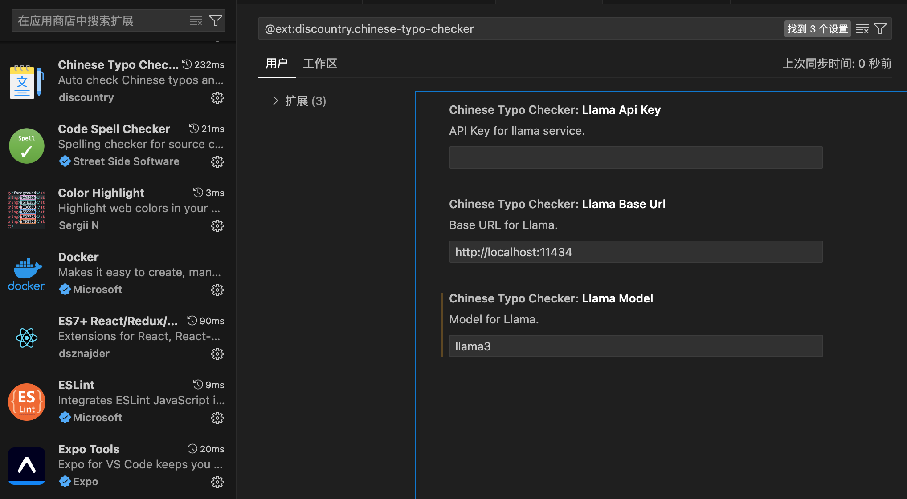

# chinese-typo-checker

[](https://marketplace.visualstudio.com/items?itemName=discountry.chinese-typo-checker)
[](https://marketplace.visualstudio.com/items?itemName=discountry.chinese-typo-checker)
[](https://marketplace.visualstudio.com/items?itemName=discountry.chinese-typo-checker)

Auto check Chinese typos and provide quick fix in VS Code.

## Installation

[Intro on Youtube](https://www.youtube.com/watch?v=HVVXktaCCPk)

Download and install from [VS Code Marketplace](https://marketplace.visualstudio.com/items?itemName=discountry.chinese-typo-checker)



Open extension config and set your own openai apikey.

```
ctrl + shift + p
```

Type and select `Check Chinese Typos`.


Watch the magic.

## Preview


